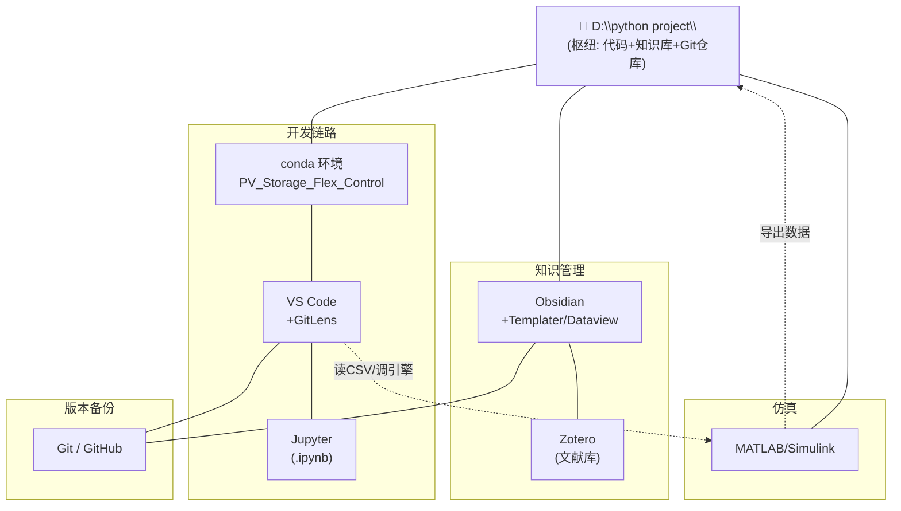

# 科研软件联动说明（研究方向3：多时间尺度能-碳调控）

> 核心思路：**以 `D:\python project\` 为唯一枢纽**。它同时是
> - conda 项目的**代码目录**
> - Obsidian 的 **Vault（知识库）**
> - Git 的**本地仓库**（可推 GitHub @glatm）
>
> 所有软件都围绕这个文件夹读写，联动就自然发生了。

## 0. 联动地图（一图看懂）



---

## 1. 开发链路：conda ↔ VS Code ↔ Jupyter

**目标**：写 `.py` 和跑 `.ipynb` 都用同一个 Python 环境（已装的 numpy/pandas/cvxpy…）。

1. **VS Code 认 conda 环境**
   - 打开 `D:\python project\` → 左下角点 Python 版本 → 选 **`Python 3.14 (PV_Storage_Flex_Control)`**。
   - 验证：新建 `test.py` 写 `import cvxpy; print(cvxpy.__version__)`，右键"在终端运行"，能出版本号即联动成功。

2. **Jupyter 也用同一环境**
   - VS Code 里新建 `.ipynb` → 右上角"选择内核" → 选 **`PV_Storage_Flex_Control`**。
   - 或在终端：`conda activate PV_Storage_Flex_Control` 后 `jupyter notebook`，浏览器里跑。
   - 这样 Notebook 里 `import` 的包和脚本完全一致，避免"脚本能跑、Notebook 报错"的撕裂。

3. **分工建议**
   - `.py`：正式算法、可复用函数、要交导师的脚本。
   - `.ipynb`：探索性分析、画图、阶段性汇报草稿（边写边看输出）。

---

## 2. 版本与备份：Git ↔ VS Code GitLens ↔ Obsidian Git

**目标**：代码和笔记都能回溯、防丢，且两拨工具推的是**同一个仓库**。

- **VS Code 侧**（代码为主）：
  - 命令面板 `Ctrl+Shift+P` → `Git: Initialize Repository`（若未初始化）→ 选 `D:\python project\`。
  - 提交：`Ctrl+Shift+G` 打开源代码管理 → 输入消息 → ✓ 提交。
  - 推送：`Git: Push`（首次需登录 GitHub @glatm）。
  - **GitLens**：在任意 `.py` 上能看到每一行是谁、哪次提交改的（代码溯源）。

- **Obsidian 侧**（笔记为主）：
  - 装好 **Obsidian Git** 后，左侧 Git 图标 → `Git: Commit all` → `Git: Push`。
  - 建议设置里开 **自动提交/自动推送**（比如每 10 分钟或关库时）。

> ⚠️ **关键**：Obsidian 和 VS Code 推的是**同一个 `.git`**，别在两个软件里各 init 一次。只要 `D:\python project\.git` 已存在，两边直接共用即可。
>
> 若 Obsidian Git 没装上（商店加载不全），**用 VS Code 这一侧推就行**——效果完全一样，不强制在 Obsidian 里弄。

- `.gitignore` 建议排除：`__pycache__/`、`*.ipynb_checkpoints/`、`.obsidian/workspace`(只保留插件配置，排除窗口布局)。

---

## 3. 知识管理：Obsidian ↔ Zotero ↔ Citations

**目标**：读文献 → 笔记里直接插引用 → 写报告时参考文献自动成形。

1. **Zotero Integration**（Obsidian 插件）连 Zotero：
   - Obsidian 设置 → Zotero Integration → 填 Zotero 的 `Better BibTeX` 导出路径（或本地 Zotero 数据文件夹）。
   - 之后在笔记里插入 `[@作者2023]` 这类引用，能自动拉出文献元数据。

2. **Citations** 插件：
   - 指向你的 `.bib` 文件（由 Zotero + Better BibTeX 导出到 `D:\python project\references\`）。
   - 写论文时 `Ctrl+P` → `Citations: Insert Citation` 搜文献名即可插入。

3. **联动产出**：论文/组会笔记里用 `[[论文三遍读法提取]]` 模板记完，文献引用自动归到 BibTeX，最后交给导师的 `.md`/`.docx` 里参考文献不漏不重。

> 你导师无 LLM 课题、做 CNN-LSTM 故障诊断，文献多在中英文期刊。建议把 Zotero 文献库也放 `D:\python project\references\`，和笔记同目录，Dataview 才能直接汇总。

---

## 4. 跨软件数据：MATLAB ↔ Python（联合仿真）

**目标**：MATLAB 跑物理/控制仿真，Python 做优化与数据分析，两边用**文件**或**引擎**交换数据。

### 方式 A：文件交换（最稳，推荐起步）
- MATLAB 仿真结果导出：`writematrix(data, 'D:\python project\data\sim_result.csv')`
- Python 读：`pd.read_csv(r'D:\python project\data\sim_result.csv')` 做优化/画图。
- 反过来 Python 把优化得到的设定值导出 CSV，MATLAB 读进去继续仿真。

### 方式 B：MATLAB Engine for Python（无缝但需装）
- 在 `PV_Storage_Flex_Control` 环境里装引擎：
  ```bash
  cd "C:\Program Files\MATLAB\R20xxx\extern\engines\python"
  python setup.py install
  ```
- Python 里直接：`import matlab.engine; eng = matlab.engine.start_matlab()`，调 `.m` 函数拿返回值。
- 优点：不用落盘、变量直接传；缺点：装引擎略麻烦，先会用方式 A 即可。

> 你计划里"阶段4 仿真验证"就用这招：Python 出日前调度曲线 → MATLAB/Simulink 跑微网动态响应 → 结果回 Python 画图对比。

---

## 5. 自动运转：Templater + Dataview + Periodic Notes + Kanban

**目标**：让 Obsidian 自己"每天转起来"，不靠手动记。

1. **Periodic Notes + Calendar + Templater**：
   - 设置 Periodic Notes → 日记模板指向 `templates/每日实验记录.md`。
   - 每天点 Calendar 当天格子 → 自动生成带日期的日记，一开始就套好格式。

2. **Dataview 自动汇总**（写一段查询放进某篇"总览"笔记）：
   ```dataview
   TABLE 阶段, 状态 FROM #任务 WHERE 状态 != "完成"
   SORT 阶段 ASC
   ```
   这样所有打了 `#任务` 标签、写了 `阶段::`、`状态::` 字段的笔记，会自动汇成一张待办表——配合 **Kanban** 看板，进度一目了然。

3. **Kanban 铺里程碑**：
   - 新建 `看板.md` 用 Kanban 插件 → 三列：`待做 / 进行中 / 已完成`。
   - 把计划里的阶段 0–8 先铺成卡片，完成一张拖一张。

---

## 6. 典型一天（串起来）

```text
08:30  开 Obsidian → Calendar 点今天 → 自动套《每日实验记录》模板
09:00  开 VS Code → 选 PV_Storage_Flex_Control 环境 → 改预测脚本
10:30  跑 Jupyter → 看 RMSE、出图
12:00  Obsidian 里用《论文三遍读法提取》记一篇刚读的文献（Citations 插引用）
14:00  MATLAB 跑仿真 → 导出 CSV → Python 读入做优化对比
17:00  填今天的实验记录 → Kanban 把完成的卡片拖到"已完成"
18:00  Obsidian Git / VS Code 各 commit 一次 → 推 GitHub
```

---

## 7. 常见联动故障

| 现象 | 原因 | 解决 |
|---|---|---|
| VS Code 里 `import cvxpy` 报错，但终端能跑 | 解释器没选 conda 环境 | 左下角切到 `PV_Storage_Flex_Control` |
| Jupyter 内核列表没有 conda 环境 | 环境没装 ipykernel | `conda activate PV_Storage_Flex_Control` → `pip install ipykernel` |
| Obsidian Git 启用后报红 | 系统没装 Git | 装 Git for Windows 并勾 Add to PATH，重启 |
| Dataview 不显示表 | 笔记没写 `字段::` 或没打标签 | 确认用了 `阶段::`/`状态::` 且带 `#任务` |
| Zotero 引用插不进 | BibTeX 路径没配 | Citations 设置里指向 `references/*.bib` |
| MATLAB 和 Python 数据对不上 | 路径/编码不一致 | 统一用 `D:\python project\data\` 下 UTF-8 的 CSV |

---

## 8. 换机/重装时的联动复原清单

1. 装 Anaconda → 建 `PV_Storage_Flex_Control` 环境（用 `environment.yml`，见《软件使用说明》）。
2. 装 Git → `git clone` 你的 GitHub 仓库到 `D:\python project\`（`.obsidian` 配置随仓库带走，Obsidian 插件配置不丢）。
3. 装 VS Code + GitLens + Markdown Preview Enhanced，打开该文件夹，选解释器。
4. 装 Obsidian，直接以 `D:\python project\` 为 Vault 打开（插件和模板全在）。
5. 装 Zotero + Better BibTeX，指向同一 `references/`。
6. 装 MATLAB（学校授权），配 Engine（可选）。
